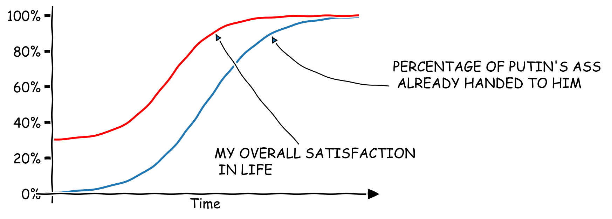

# putinplotlib
> Matplotlib but with added Putin support.  

This repository aims to replicate the matplotlib functionality while also attempting to visualize the relationships between important geopolitical variables (e.g The ratio between booted and yet-to-be-booted backside of Mr. Putin). 

## Custom plots

Below we can visualize a relationship between two such variables:

The above figure shows a positive correlation between my personal satisfaction with life and the mean percentage of already delivered own posterior (MPADOP) to Mr. Putin. 

We welcome all contributions!